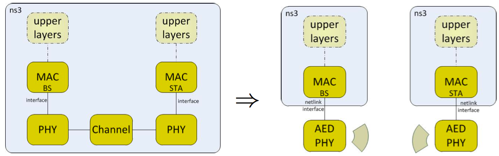

# COUWBAT NS3

This repository contains the ns3 simulation environment developed in the [COUWBAT - Cognitive Ultra Wideband Transceiver](http://www.forschung-it-sicherheit-kommunikationssysteme.de/projekte/couwbat) project. Further with the provided netlink interface it is possible to use this ns3 simulated stack with real hardware provided by the project partner.



## General Information
* The whole COUWBAT stack is implemented and documented by a ns3 module in [ns-allinone-3.23/ns-3.23/src/couwbat](ns-allinone-3.23/ns-3.23/src/couwbat).
* This repository is configured to build the COUWBAT module together with examples and tests, modules that are required to build the documentation are built as well (see [.ns3rc](./ns-allinone-3.23/ns-3.23/.ns3rc)).
* This repository also builds dependency modules of the COUWBAT module. (see [wscript](ns-allinone-3.23/ns-3.23/src/couwbat/wscript)).

#### Build ns3 with couwbat module
```sh
cd ns-allinone-3.23/ns-3.23/

### apply the settings from .ns3rc
./waf configure

### just to be sure
./waf clean

### build ns3 with couwbat 
./waf

### if you want to run the ns3 test suite
./waf check
```

## Example scenarios
We evaluate our proposed MAC and PHY specifications in three different scenarios.

### Spectrum database scenario
The spectrum database example is scripted in [couwbat-spectrum-db.cc](ns-allinone-3.23/ns-3.23/src/couwbat/examples/couwbat-spectrum-db.cc). The scenario deploys one node which holds the spectrum database, further three primary user nodes will be deployed. They use the spectrum database via direct memory access. In this setting each primary user occupies one part of the spectrum. The three PUs are controlled by three different on-off models. 
The first node is turned on and off once. 
The second node is turned on and periodically switches on and off. Here the duration length is different. It runs until the end of the simulation. 
The third node is turned on and switch between on and off with a random duration between one and two seconds. 
When a primary user turned on or off it the spectrum database will be immediately informed about the spectrum allocation change. The spectrum database is keep a global spectrum map. The number of subcarriers in the spectrum is set via the ```COUWBAT_SUBCARRIERS``` define variable in [couwbat.h](./ns-allinone-3.23/ns-3.23/src/couwbat/model/couwbat.h).

``` sh
cd ns-allinone-3.23/ns-3.23/

# suggested option to run:
NS_LOG="*=prefix_all" ./waf --run="couwbat-spectrum-db"
# or
./run_couwbat_spectrum_db.sh

# for more options use:
./waf --run="couwbat-spectrum-db --PrintHelp"

# to obtain randomness accross multiple runs you should change the random number generator run:
NS_LOG="*=prefix_all" ./waf --run="couwbat-spectrum-db --RngRun=2"
```

**Note:** ns3 produces deterministic results by default. To get randomness you could change the random number generator seed or the run number which is the preferred way (see [ns3 Manual - Random Variables](http://www.nsnam.org/docs/release/3.23/manual/html/random-variables.html)).

### Point-to-(multi)point communication
The point-to-point or point-to-multipoint scenario (run_couwbat_ptp.sh) forms the baseline scenario. Here it is possible to deploy one Cognitive Radio Basestation (CR-BS) and *n* Cognitive Radio Stations (CR-STA) randomly placed, as well as a traced based Primary User (PU). Example PU traces can be found in the [traces/](traces/) folder.

```sh
cd ns-allinone-3.23/ns-3.23/

# for all options run:
./run_couwbat_ptp.sh -h
```

#### Standard simulation parameters

| Parameter | Value |
| --- | --- |
|  Number of CR-BS       | 1 |
|  Number of CR-STAs     | varied |
|  Placement             | random and fixed |
|  Heights               | CR-BS 30m, CR-STA 6m |
|  Bandwidth             | 512MHz (2048 subcarrier) |
|  Subchannels           | 64 |
|  Subcarrier per subchannel | 32 |
|  Total number of subcarriers (FFT size)      | 2048 |
|  Propagation model     | Okumura Propagation Model (small city, urban environment) per subchannel |
|  Fading model          | Nakagami Fading Model per subchannel|
|  Transmit power        | 17 dBm |
|  Modulation & coding scheme  | QPSK 1/2,3/4; 16-QAM 1/2,3/4; 64-QAM 1/2,2/3,3/4|
|  PU model              | Trace-based PU, but not interfering (Data base)|

### Interaction with the COUWBAT hardware
Two special scenarios are given by *run_netlink_couwbat.sh* and *run_hw_netlink_couwbat.sh*. 
The first one deploys a loopback between a CR-BS and a CR-STA simulated in ns3 via a [netlink](https://wiki.linuxfoundation.org/networking/netlink) interface. This can be also used without the COUWBAT hardware.

The second example script allows the access to the ultra-wideband COUWBAT hardware developed by the project partner.

```sh
cd ns-allinone-3.23/ns-3.23/

# for all options of the loopback scenario:
./run_netlink_couwbat.sh -h

# for direct interaction with the COUWBAT hardware
./run_hw_netlink_couwbat.sh
```

## Documentation
* [COUWBAT Model Library](ns-allinone-3.23/ns-3.23/doc/models/build/html/couwbat.html) (available from repository without local build)
* [COUWBAT API Documentation](ns-allinone-3.23/ns-3.23/doc/html/group__couwbat.html) (requires local build)

The COUWBAT module is documented like any other ns3 module (see [ns3 Manual - Creating Documentation](http://www.nsnam.org/docs/release/3.23/manual/html/documentation.html)). Doxygen produces the API documentation from the [source files](ns-allinone-3.23/ns-3.23/src/couwbat). Sphinx produces the ns3 tutorial, ns3 manual and ns3 model library from reStructuredText sources (see [couwbat.rst](ns-allinone-3.23/ns-3.23/src/couwbat/doc/couwbat.rst)). 

Only the built COUWBAT part of the model library is included in this repository. All other built documentation is excluded from this repository via [gitignore](.gitignore). You can still build all documentation locally from the source files.
The API documentation is excluded from the repository because it occupies over 2GB (local build takes ~45 minutes). The ns3 tutorial, ns3 manual and ns3 model library (except couwbat part) are excluded from the repository because they are not relevant for the couwbat documentation (local build takes ~3 minutes). 

Keep in mind that `./waf clean` also cleans any built documentation.

### Build the documentation
Build ns3 with couwbat module first.
``` sh
cd ns-allinone-3.23/ns-3.23/

# build tutorial, manual and model library
./waf sphinx

# build doxygen API documentation (~2.2GB, 45 minutes)
./waf doxygen
```

## About ns3
* Website: [http://www.nsnam.org](http://www.nsnam.org)
* Version: ns-3.23 ([ns-allinone-3.23](https://www.nsnam.org/release/ns-allinone-3.23.tar.bz2))
* [Documentation](http://www.nsnam.org/ns-3-19/documentation/)
	* [Tutorial](http://www.nsnam.org/docs/release/3.23/tutorial/html/index.html)
	* [Manual](http://www.nsnam.org/docs/release/3.23/manual/html/index.html)
	* [Model Library](http://www.nsnam.org/docs/release/3.23/models/html/index.html)
	* [API](http://www.nsnam.org/docs/release/3.23/doxygen/index.html)
* For advanced logging see [ns3 Manual - Logging](http://www.nsnam.org/docs/release/3.23/manual/html/logging.html).


## NS3 + eclipse
http://www.nsnam.org/wiki/HOWTO_configure_Eclipse_with_ns-3

## References and further information
For further information please consult the Technical Report [Overlay Cognitive Radio for Small-Cell Backhauling - R&D Project COUWBAT -](http://www.tkn.tu-berlin.de/fileadmin/fg112/Papers/2017/Zubow17overlay_cognitive_radio.pdf).

Please use the following bibtex :
```
@TechReport{Zubow17overlay_cognitive_radio,
    author = {Zubow, Anatolij and Döring, Michael and Chwalisz, Mikolaj and Wolisz, Adam},
    title = {{Overlay Cognitive Radio for Small-Cell Backhauling -- R\&D Project COUWBAT --}},
    institution = {Telecommunication Networks Group, Technische Universit\"{a}t Berlin},
    year = {2017},
    month = {February},
    number = {TKN-16-003},
    url = {http://www.tkn.tu-berlin.de/fileadmin/fg112/Papers/2017/Zubow17overlay_cognitive_radio.pdf}
    }
```

## Contact
* Michael Döring, TU-Berlin, doering@tkn
* Anatolij Zubow, TU-Berlin, zubow@tkn
* Mikolaj Chwalisz, TU-Berlin, chwalisz@tkn
* tkn = tkn.tu-berlin.de
